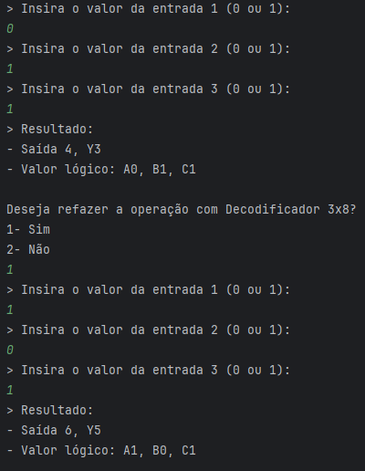

# Circuitos Digitais

Na atual versão, o projeto é uma simulação de **decodificadores** e **multiplexadores** em Java, permitindo que o usuário interaja com diferentes tipos de circuitos digitais. O objetivo é proporcionar uma ferramenta para estudar e simular o comportamento desses componentes, que são muito utilizados em sistemas digitais, como controle de memória, multiplexação de sinais e seleção de linhas.

O projeto inclui os seguintes tipos de decodificadores e multiplexadores:

# Decodificadores:
- **2x4**: Converte 2 bits de entrada em uma única saída entre 4 possíveis.
- **3x8**: Converte 3 bits de entrada em uma única saída entre 8 possíveis.
- **4x16**: Converte 4 bits de entrada em uma única saída entre 16 possíveis.
- **5x32**: Converte 5 bits de entrada em uma única saída entre 32 possíveis.
- **6x64**: Converte 6 bits de entrada em uma única saída entre 64 possíveis.
- **7x128**: Converte 7 bits de entrada em uma única saída entre 128 possíveis.
- **8x256**: Converte 8 bits de entrada em uma única saída entre 256 possíveis.
- **9x512**: Converte 9 bits de entrada em uma única saída entre 512 possíveis.

# Multiplexadores:
- **4x1**: Recebe 4 entradas e utiliza 2 bits de controle para selecionar qual entrada será encaminhada para a saída.
- **8x1**: Recebe 8 entradas e utiliza 3 bits de controle para selecionar qual entrada será encaminhada para a saída.

# Como Funciona
- Decodificadores:
O decodificador recebe um número de entradas binárias e ativa uma saída específica com base na combinação de bits de entrada. Cada decodificador tem um número específico de entradas e saídas.

- Multiplexadores:
O multiplexador seleciona uma de várias entradas com base em um conjunto de bits de controle (seletores) e direciona essa entrada para a saída. Isso é útil para reduzir a quantidade de conexões necessárias em sistemas digitais.

--------------------------------------------------------------------------------------------------------------------------------------------------------------------------------------------------------------------------------------

# Instalação passo-a-passo
Clique para baixar o IntelliJ IDEA caso queira:
<a href="https://www.jetbrains.com/idea/">
  
</a>)

- 1> Clone a pasta do código este repositório:
   ```bash
   git config core.sparseCheckout true
   echo "circuitos/" >> .git/info/sparse-checkout
   git clone https://github.com/cai0duque/Circuitos-logicos.git
   git pull origin main

- 2> Compile os arquivos java (caso queira rodar fora do intelliJ)
```bash
javac -d bin src/decodificador/*.java
```
- 3> Executar o programa:
```bash
java -cp bin decodificador.Main
```
# Como Usar
Ao iniciar o programa, você verá um menu com opções para escolher o tipo de decodificador ou multiplexador que deseja simular. Após escolher, será solicitado que você insira os valores de entrada ou os bits de controle. O programa então calculará e exibirá a saída correspondente.

# Exemplo de Decodificador 2x4
Após selecionar a opção para o decodificador 2x4, você será solicitado a fornecer dois valores binários (0 ou 1) como entradas. O programa irá calcular e exibir a saída correspondente (Y0, Y1, Y2, ou Y3).
```bash
> Insira o valor da entrada 1 (0 ou 1):
1
> Insira o valor da entrada 2 (0 ou 1):
0
> Resultado:
- Saída 3, Y2
- Valor lógico A1, B0
```

# Exemplo de Multiplexador 4x1
Após selecionar a opção para o multiplexador 4x1, você fornecerá os valores de 4 entradas e 2 bits de controle. O programa selecionará a entrada correspondente e exibirá o resultado.
```bash
> Insira o valor da entrada 0 (0 ou 1):
0
> Insira o valor da entrada 1 (0 ou 1):
1
> Insira o valor da entrada 2 (0 ou 1):
0
> Insira o valor da entrada 3 (0 ou 1):
1
> Insira o valor do seletor 0 (0 ou 1):
1
> Insira o valor do seletor 1 (0 ou 1):
0
> Resultado:
Saída selecionada: 0
```

# Ação
Aqui estão algumas capturas de tela mostrando o programa em ação:

# Decodificadores
- **Decodificador 2x4**:

  

- **Decodificador 3x8**:

  

# Multiplexadores

# Contribuições
Sinta-se à vontade para fazer um fork deste projeto e contribuir com novas funcionalidades, melhorias ou correções de bugs.

# Licença

Este projeto está licenciado sob a Licença MIT - veja o arquivo [LICENSE](License) para mais detalhes.

